# 2nd week report

## Entities Created

You have defined multiple **JPA entities** representing the system domain:

### User

- Fields: `id`, `username`, `password`, `email`, `fullName`
- Relationship:
  - `@ManyToMany` with **Role** via join table `user_roles`

### Role

- Represents user roles (e.g., `ADMIN`, `STUDENT`, `INSTRUCTOR`)

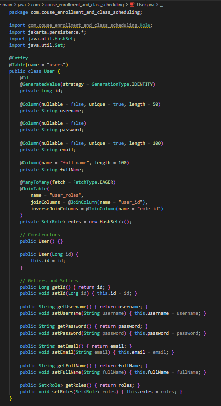

### Course

- Represents a course offered in the system

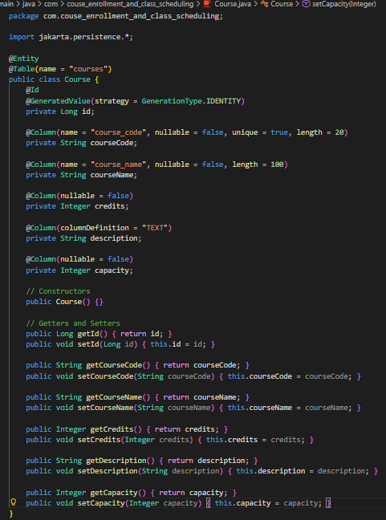

### Classroom

- Represents physical or virtual classrooms

### ClassSchedule

- Represents scheduling information for courses

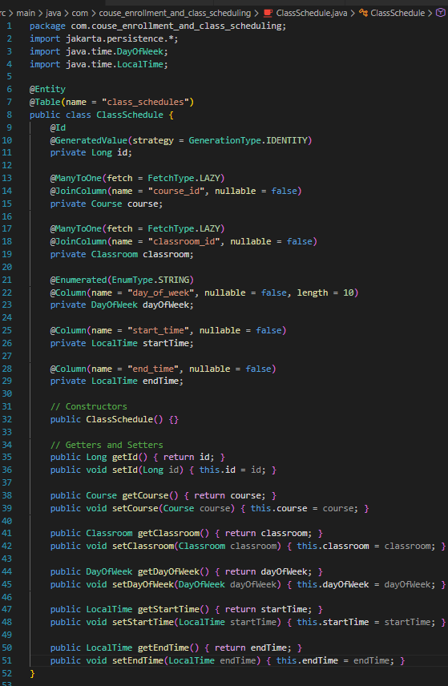

### Enrollment

- Represents student enrollment in courses or schedules

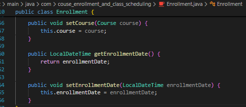

All entities are annotated with `@Entity`, `@Table`, and proper JPA mappings.

---

## Relationships Implemented

- **User ↔ Role** → `@ManyToMany`
- **Enrollment** connects users to courses and/or class schedules
- **Scheduling entities** link **Course**, **Classroom**, and time-related information

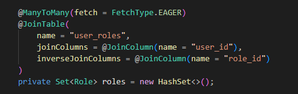

---

## Repositories

You created **Spring Data JPA repositories** for each main entity:

- `UserRepository`
- `RoleRepository`
- `CourseRepository`
- `ClassScheduleRepository`
- `EnrollmentRepository`

These repositories handle database operations automatically.

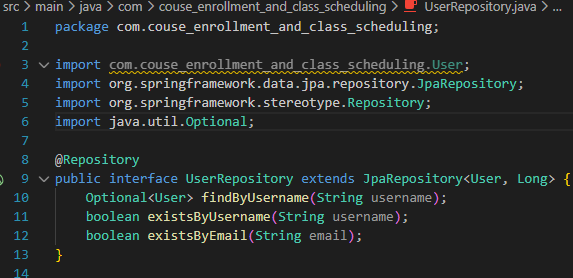
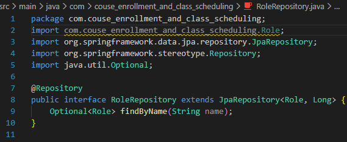

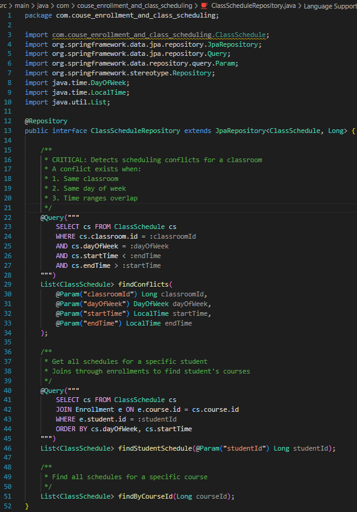
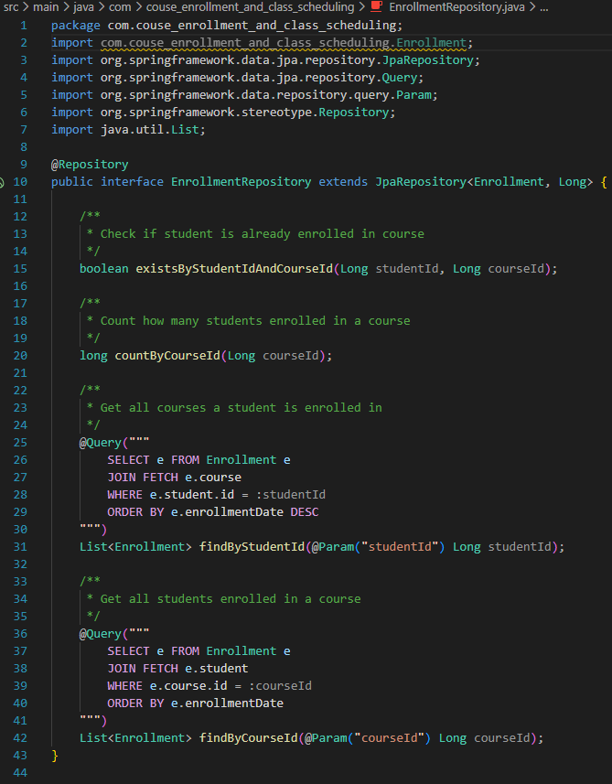

---

## DTOs & Requests

- `ClassScheduleDTO`
- `EnrollmentRequest`

These are used to separate **API input/output models** from **entity models**, following good design practices.

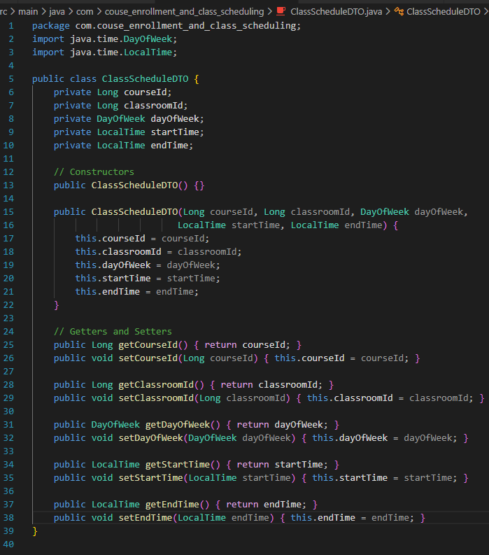
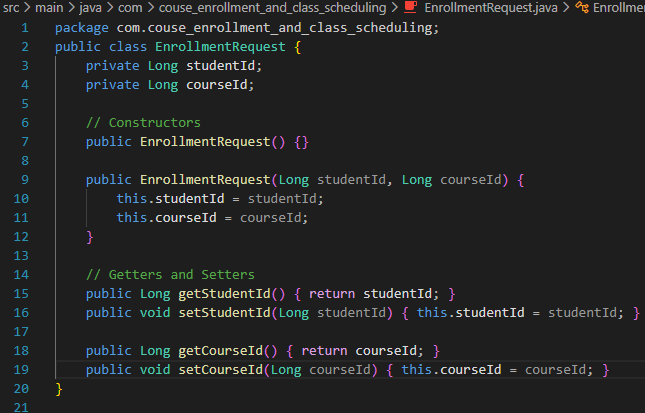

---

## Database & Migration

- Integrated **Flyway** for database version control
- Created migration file:
  - `V1__Create_Tables.sql`
- The database successfully initializes and applies migrations on application startup

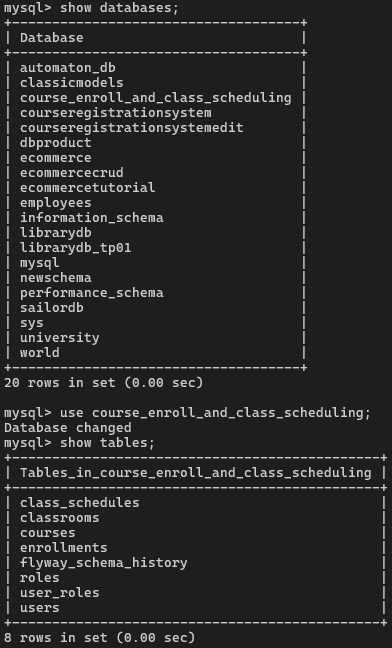
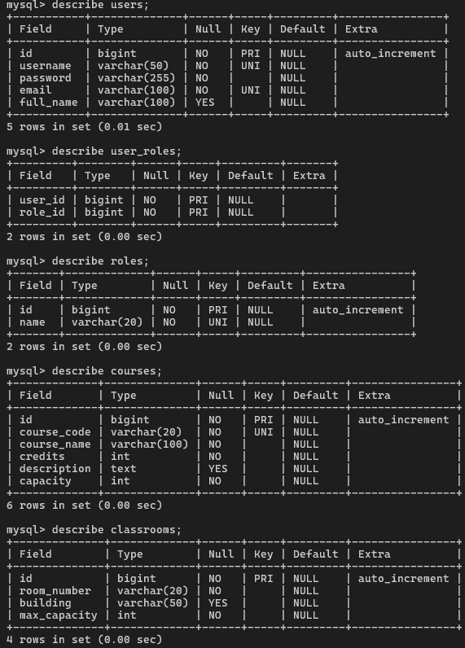
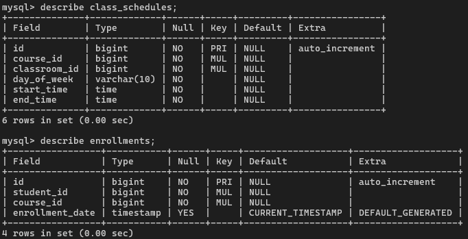
